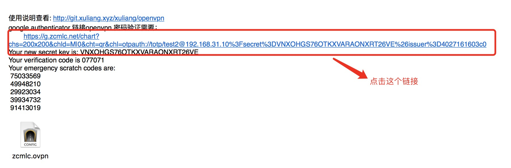
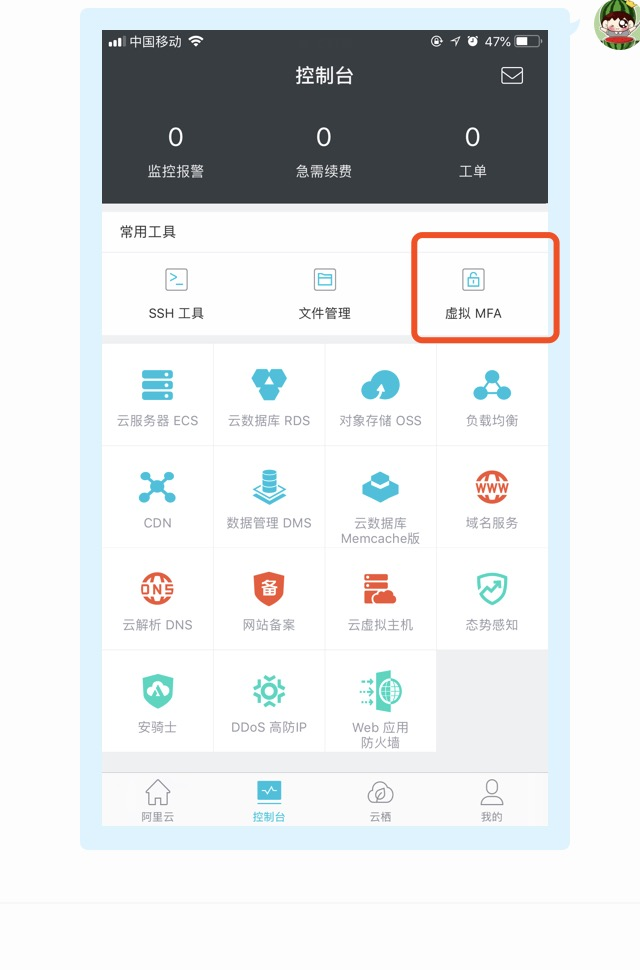

### 配置说明
通过自己的企业邮箱下载如下三个配置文件 
* zcm-lan.ovpn   这个配置可以办公室才能使用
* zcm-wlan.ovpn  这个配置可以在家里才能使用
* zcm-back.ovpn  这个是备用节点配置，以防在链接不上时候用


### 一、手机下载安装Google Authenticator
* 安卓版本手机 您可以在您常用的应用市场搜索“安卓版Google Authenticator"进行安装 或者在git目录下载"安卓authenticator2_5.00_liqucn.com.apk"

* IOS版本手机 您可以进入苹果应用市场(App Store)搜索”Google Authenticator”进行安装，也可以扫描下面的二维码进行安装


### 二、Google Authenticator身份绑定
1. 打开自己的企业邮箱，打开如图发给你们的链接。点击访问

2. 打开手机软件Google Authenticator 扫描打开的二维码图标，进行身份绑定。


> 注意：此时的openvpn 用户名是邮箱发你的用户名 密码是Google Authenticator 绑定随机码。登录成功，请勿保存密码。下次登录密码会随机生成

### 三、Windows下OpenVPN的安装使用
```
1.window 客户端：2.4_rc1(不支持XP,不分系统位数，可保存用户密码)

2.下载windows客户端，双击运行安装程序，请按照默认选项安装，如果弹出TAP网卡安装提示,请允许
3.从邮箱附件下载 zcm-lan.ovpn，zcm-wlan.ovpn 和zcm-back.ovpn 三个文件
拷贝到到openvpn安装目录config下面,一般是
   C:\program files\openvpn\config，也可能是C:\Program Files (x86)\OpenVPN\config

4.运行OpenVPN GUI快捷键
5.桌面右下角找到对应图标，右键选择可用的配置文件点击“connect”
6.如果客户端里提示路由配置错误，请退出程序，右键OpenVPN GUI快捷键，使用管理员身份运行
7.客户端setting里，默认代理为配置文件中的代理，即默认不使用代理，如果使用中提示代理错误，请检查是否误配置
```
不懂的话可以参考window的安装说明：http://www.vpngate.net/cn/howto_openvpn.aspx  

### 四、Mac 下的openvpn的安装使用
* mac客户端Shimo 4.1.5.1.dmg 或者mac客户端Tunnelblick_3.6.9_build_4685.rar
* mac客户端Tunnelblick 参考说明:http://www.jianshu.com/p/a5fd8dc95ad4
* mac客户端Shimo       参考说明:http://www.vpngate.net/cn/howto_openvpn.aspx


### 五、注意事项
* 安卓手机安装了软件Google Authenticator，提示更新Google Play 服务后才能使用条形码
请在安卓应用市场下载阿里云安装软件app ，如图点击MFA，扫描邮箱内链接的二维码图片

* mac系统由于共享wifi所在网段和openvpn 办公室链接的网段冲突，请重新设置mac 网段方法如下：
```
# 手动设置热点IP：
sudo defaults write /Library/Preferences/SystemConfiguration/com.apple.nat NAT -dict-add SharingNetworkNumberStart 192.168.83.0
sudo defaults write /Library/Preferences/SystemConfiguration/com.apple.nat NAT -dict-add SharingNetworkNumberEnd 192.168.83.100
sudo defaults write /Library/Preferences/SystemConfiguration/com.apple.nat NAT -dict-add SharingNetworkMask 255.255.255.0
```
然后关闭再打开一下热点即可。 os x版本： 10.14.5 ，重启电脑

### 六、手机客户端参考
* 校外访问校内网络服务及VPN服务的说明 http://info.swufe.edu.cn/vpn/openvpn/
* 苹果手机 美国账号可以下openvpn软件，国内不行，参考： https://freeid.xyz

